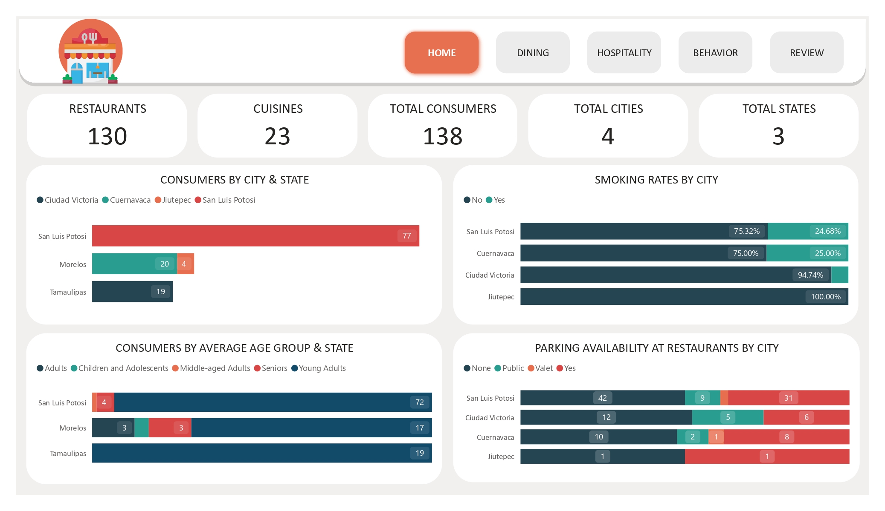

# Restaurant Ratings Analytics

## Introduction
This project aims to analyze restaurant ratings in Mexico using a comprehensive dataset collected from real consumers. By examining consumer demographics, preferences, and restaurant attributes, the project provides actionable insights into dining behaviors, hospitality trends, and factors influencing customer satisfaction. The analysis supports data-driven decision-making for restaurant owners, marketers, and hospitality professionals.

## Table of Content

* [Case Study](#case-study)
* [Dataset Description](#dataset-description)
* [ER Diagram](#er-diagram)
* [Data Cleaning](#data-cleaning)
* [Data Analysis](#data-analysis)
* [Dashboard](#dashboard)

## Case Study
This case study explores restaurant ratings in Mexico, collected from real consumers in 2012. It provides detailed insights into restaurant offerings, cuisine types, and comprehensive consumer profiles—including preferences and demographics—to understand factors influencing dining choices and

## Dataset Description
Our data set consists of the following observations which include:
### Consumers
- **Consumer_ID**: Unique identifier for each consumer.
- **City**: City where the consumer resides.
- **State**: State where the consumer resides.
- **Country**: Country where the consumer resides.
- **Latitude**: Latitude of the consumer's location.
- **Longitude**: Longitude of the consumer's location.
- **Smoker**: Indicates whether the consumer smokes.
- **Drink_Level**: Categorization of the consumer as an abstemious, casual, or social drinker.
- **Transportation_Method**: Mode of transportation used by the consumer (on foot, public transport, or car).
- **Marital_Status**: Marital status of the consumer (single or married).
- **Children**: Indicates whether the consumer has dependent or independent children.
- **Age**: Age of the consumer.
- **Occupation**: Occupation of the consumer (student, employed, or unemployed).
- **Budget**: Budget category of the consumer (low, medium, or high).

### Consumer_Preferences
- **Consumer_ID**: Unique identifier for each consumer.
- **Preferred_Cuisine**: Types of cuisine preferred by the consumer.

### Ratings
- **Consumer_ID**: Unique identifier for each consumer.
- **Restaurant_ID**: Unique identifier for each restaurant.
- **Overall_Rating**: Overall rating given by the consumer to the restaurant (0 = Unsatisfactory, 1 = Satisfactory, 2 = Highly Satisfactory).
- **Food_Rating**: Rating for the food given by the consumer (0 = Unsatisfactory, 1 = Satisfactory, 2 = Highly Satisfactory).
- **Service_Rating**: Rating for the service given by the consumer (0 = Unsatisfactory, 1 = Satisfactory, 2 = Highly Satisfactory).

### Restaurants
- **Restaurant_ID**: Unique identifier for each restaurant.
- **Name**: Name of the restaurant.
- **City**: City where the restaurant is located.
- **State**: State where the restaurant is located.
- **Country**: Country where the restaurant is located.
- **Zip_Code**: Zip code of the restaurant's location.
- **Latitude**: Latitude of the restaurant's location.
- **Longitude**: Longitude of the restaurant's location.
- **Alcohol_Service**: Type of alcohol service offered (none, wine & beer, or full bar).
- **Smoking_Allowed**: Indicates whether smoking is allowed in the restaurant (including bar or smoking sections).
- **Price**: Price category of the restaurant (low, medium, or high).
- **Franchise**: Indicates whether the restaurant is part of a franchise.
- **Area**: Specifies whether the restaurant is in an open or closed area.
- **Parking**: Type of parking available at the restaurant (none, yes, public, or valet).

### Restaurant_Cuisines
- **Restaurant_ID**: Unique identifier for each restaurant.
- **Cuisine**: Types of cuisine served by the restaurant.	

## ER Diagram


## Data Cleaning
### Steps to import data as a folder
1. Get data -> More -> All -> Folder -> Connect -> Path leading to the folder dataset -> Click ok
2. Click on transform data -> Duplicate the file -> Click on Binary to expand the dataset (Repeat the set for the no of datasets)
3. Calculated Fields

#### Age Group
```
AgeGroup = 
SWITCH(
    TRUE(),
    consumers[Age] <= 18, "Children and Adolescents",
    consumers[Age] <= 30, "Young Adults",
    consumers[Age] <= 45, "Adults",
    consumers[Age] <= 60, "Middle-aged Adults",
    "Seniors"
)
```
#### Service Rating Category
```
Service_Rating_Category = SWITCH(
    TRUE(),
    ratings[Service_Rating] = 0, "Unsatisfactory",
    ratings[Service_Rating] = 1, "Satisfactory",
    "Highly Satisfactory"
)
```
#### Overall Rating Category
```
Overall_Rating_Category = SWITCH(
    TRUE(),
    ratings[Overall_Rating] = 0, "Unsatisfactory",
    ratings[Overall_Rating] = 1, "Satisfactory",
    "Highly Satisfactory"
)
```
#### Food Rating Category
```
Food_Rating_Category = SWITCH(
    TRUE(),
    ratings[Food_Rating] = 0, "Unsatisfactory",
    ratings[Food_Rating] = 1, "Satisfactory",
    "Highly Satisfactory"
)
```

## Data Analysis
### Local Insights:
- **Distribution of Consumers by City and State**  
    The majority of the population resides in San Luis Potosí, San Luis Potosí, followed by Cuernavaca, Morelos.

- **Age Distribution of Consumers by State**  
    Young adults under 30 years of age form the largest demographic across all three states. Seniors aged over 60 years represent the second largest group in San Luis Potosí and Morelos.

- **Smoking Habits of Consumers by City**  
    Non-smokers dominate the population in all four cities, with Jiutepec having a 100% non-smoking population. In Cuernavaca, 25% of the population are smokers.

- **Parking Availability at Restaurants by City**  
    Most restaurants across all cities lack parking facilities. However, valet parking is available at two restaurants in San Luis Potosí and Cuernavaca. Public parking is accessible in San Luis Potosí, Ciudad Victoria, and Cuernavaca.

### Dining Insights:
- **How does the availability of parking correlate with restaurant price levels?**  
    Among the 16 high-priced restaurants, all provide parking facilities, with 3 offering valet parking, 1 providing public parking, and 5 lacking any parking options. Medium and low-priced restaurants do not offer valet parking; however, some provide public parking or general parking, while others lack parking facilities entirely.

- **What is the distribution of restaurants by state?**  
        San Luis Potosí hosts the majority with 84 restaurants, while Morelos and Tamaulipas each have 23 restaurants.

- **How do restaurant franchises compare to non-franchises in terms of consumer ratings?**  
    Non-franchise restaurants dominate and are evenly distributed across the three rating categories: unsatisfactory, satisfactory, and highly satisfactory. Franchise restaurants, though fewer in number, also show an even distribution across the same rating categories.

- **What are consumers' preferred cuisines based on their demographic profiles?**  
    Mexican cuisine is the most popular choice among consumers, followed by American cuisine.


### Hospitality Insights:
- **How does the type of alcohol service offered vary by restaurants in each city?**  
    Across the four cities—Jiutepec, San Luis Potosí, Cuernavaca, and Ciudad Victoria—66.92% of restaurants do not serve alcohol, 26.15% serve wine and beer, and 6.93% offer a full bar.

- **What transportation methods are most commonly used by consumers?**  
    Public transportation is the most popular choice, used by 61% of consumers, followed by cars at 27%, and walking at 11%.

- **How does the presence of alcohol service influence consumer ratings?**  
    - **Non-drinkers:** 303 rated their experience as highly satisfactory, 289 as satisfactory, and 170 as unsatisfactory.  
    - **Wine and beer consumers:** 146 rated highly satisfactory, 105 as satisfactory, and 68 as unsatisfactory.  
    - **Full bar consumers:** 37 rated highly satisfactory, 27 as satisfactory, and 16 as unsatisfactory.

- **What percentage of restaurants allow smoking in each state?**  
    Approximately 73% of restaurants enforce smoke-free policies. Only 1.5% of restaurants in San Luis Potosí and Morelos allow smoking in bar sections. Around 7% of restaurants permit smoking overall, with 18.46% offering designated smoking areas.

### Behavior Insights:
- **What are the common occupations of consumers in different states?**  
    - In **San Luis Potosí**, 93% of the population are students, with the remainder being employed or unemployed individuals.  
    - In **Morelos**, the population is nearly evenly divided between employed individuals and students.  
    - In **Tamaulipas**, 94% of the population are students, while the remaining 6% are employed.

- **How does the drink level (abstemious, casual, social) vary across different states?**  
    - In **San Luis Potosí**, 40% of the population are social drinkers, 36% are casual drinkers, and 23% are abstemious.  
    - In **Morelos**, 45% are abstemious, 41% are casual drinkers, and 12% are social drinkers.  
    - In **Tamaulipas**, 52% are abstemious, 31% are casual drinkers, and 15% are social drinkers.

- **How does marital status correlate with smoking or drinking habits?**  
    - Among **88 single consumers**, all are non-smokers, with varying drink levels: abstemious, casual drinkers, and social drinkers.  
    - Among **married non-smokers**, 2 are abstemious, and 5 are social drinkers.  
    - Among **single smokers**, 23 individuals are either casual or social drinkers.  
    - Among **married smokers**, 2 individuals are also social drinkers.

- **Is there a relationship between consumers' occupations and their budget levels?**  
    - Among **students**, 67 have a medium budget, 33 have a low budget, and 4 have a high budget.  
    - Among **employed individuals**, 15 have a medium budget.  
    - Among **unemployed individuals**, 1 has a medium budget.

### Review Insights: 
- **Top 5 Restaurants by Food Rating**  
    The top restaurants with the highest food ratings include:  
    - **Tortas Locas Hipocampo** and **Puesto de Tacos**, where most consumers are highly satisfied.  
    - **Cafeteria y Restaurante El Pacífico**, with 9 highly satisfactory ratings.  
    - **Gorditas Doña Gloria**, receiving 10 highly satisfactory ratings.  
    - **La Cantina Restaurante**, rated highly satisfactory by 11 consumers, with other ratings split between satisfactory and unsatisfactory.

- **Top 5 Restaurants by Service Rating**  
    The leading restaurants for service ratings are:  
    - **Tortas Locas Hipocampo**, where most consumers are satisfied.  
    - **Puesto de Tacos**, with 12 satisfied consumer ratings.  
    - **Cafeteria y Restaurante El Pacífico**, also receiving 12 satisfactory ratings.  
    - **Gorditas Doña Gloria**, matching with 12 satisfied ratings.  
    - **La Cantina Restaurante**, rated satisfactory by 7 consumers, with other ratings divided between highly satisfactory and unsatisfactory.

- **Top 5 Restaurants by Overall Rating**  
    The top restaurants based on overall ratings are:  
    - **Tortas Locas Hipocampo**, where most consumers are highly satisfied.  
    - **Puesto de Tacos**, with 30 highly satisfied consumer ratings.  
    - **Cafeteria y Restaurante El Pacífico**, garnering 24 highly satisfactory ratings.  
    - **La Cantina Restaurante**, with 28 highly satisfied ratings.  
    - **Restaurant la Chalita**, receiving 20 high satisfaction ratings from its customers.
  
## Dashboard



